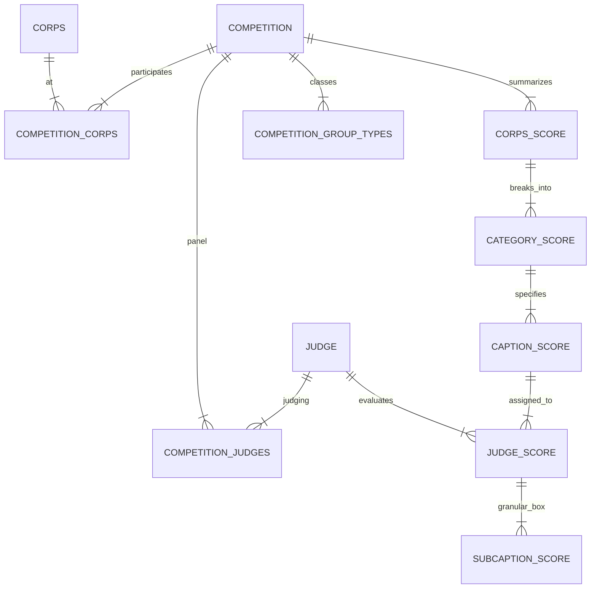

# DCI Domain & Scoring Guide

This document explains the domain model for Drum Corps International (DCI) data, focusing on how competitions are structured and how the scoring system works, as implemented in the SDK and database.

## 1. Core Concepts

### Seasons and Competitions
*   **Season**: A yearly tour (e.g., "2024").
*   **Competition**: A specific contest event (e.g., "DCI World Championship Finals").
    *   Identified by a `slug` (e.g., `dci-world-championship-finals-2024`).
    *   Has a `date`, `location`, and associated `events`.
*   **Event**: The logistical container (venue, tickets, schedule). A single Event might host a Competition (or multiple).

### Corps (The Units)
*   **Corps**: The marching units (e.g., "Blue Devils", "Santa Clara Vanguard").
*   **Division**: Corps compete in classes:
    *   **World Class**: The premier level.
    *   **Open Class**: Developmental level.
    *   **All-Age**: Independent/Weekend-only corps.

## 2. The Scoring System (The "Recap")

DCI scores are out of **100 points**. The score sheet (or "Recap") is hierarchical.

### The Hierarchy
1.  **Total Score**: The final aggregated score (0-100).
2.  **Categories** (The Three Pillars):
    *   **General Effect (GE)**: Worth **40.00** points.
    *   **Visual**: Worth **30.00** points.
    *   **Music**: Worth **30.00** points.
3.  **Captions** (The Specific Disciplines): Each Category is guarded by specific Captions.
    *   *General Effect*: GE 1, GE 2 (often two judges/panels).
    *   *Visual*: Visual Proficiency, Visual Analysis, Color Guard.
    *   *Music*: Music Analysis, Brass, Percussion.
4.  **Judges**: Each Caption is evaluated by one or more judges.
5.  **Subcaptions** (The "Box" Scores):
    *   Each judge typically gives two sub-scores:
        *   **Content (Repertoire)**: The difficulty and quality of the design ("The What").
        *   **Achievement (Performance)**: How well the performers execute the design ("The How").
    *   These are scored out of 100 or 200 (internally scaled).

### Scoring Algorithm & Math

The final score is a composite of averages and sums. Here is the precise breakdown based on DCI rules:

1.  **General Effect (40.00 pts)**
    *   Split into **GE 1** and **GE 2** sub-captions (20 pts each).
    *   **Double Panels**: Often, there are TWO judges for GE 1 and TWO for GE 2.
    *   **Calculation**:
        *   `Average(GE1 Judge A, GE1 Judge B) = GE1 Total`
        *   `Average(GE2 Judge A, GE2 Judge B) = GE2 Total`
        *   `GE1 Total + GE2 Total = Overall GE Score`

2.  **Visual (30.00 pts)**
    *   Three captions: **Analysis**, **Proficiency**, **Color Guard**.
    *   Each is scored out of 20.00 (on the sheet).
    *   **Calculation**:
        *   `Total Visual = (Analysis + Proficiency + Color Guard) / 2`
        *   *(Since 20+20+20 = 60, dividing by 2 scales it to 30)*

3.  **Music (30.00 pts)**
    *   Three captions: **Analysis**, **Brass**, **Percussion**.
    *   Each is scored out of 20.00.
    *   **Double Panels**: Music Analysis (MA) and Percussion are also frequently judged by double panels (two judges), whose scores are averaged.
    *   **Calculation**:
        *   `Total Music = (Avg(Analysis) + Avg(Brass) + Avg(Percussion)) / 2`
        *   *(If a caption has only 1 judge, the average is just that single score)*

**Final Calculation**:
`Total Score = GE Score + Visual Score + Music Score - Penalties`

> **Example**:
> *   GE 1 Judges give 19.60 and 20.00 -> Avg: 19.80
> *   GE 2 Judges give 19.70 and 20.05 -> Avg: 19.875
> *   **GE Total** = 39.675
> *   Visual (unscaled sum 58.0) -> Scaled: 29.00
> *   Music (unscaled sum 59.0) -> Scaled: 29.50
> *   **Gross Score**: 39.675 + 29.00 + 29.50 = 98.175
> *   **Penalties**: -0.00
> *   **Final Score**: **98.175**

## 3. Database Schema Relationships

The database (`dci-relational.db`) reflects this hierarchy using Relational Tables.

### Tables Overview
*   **Core Entities**: `competitions`, `corps`, `judges`.
*   **Metadata types**: `competition_types`, `group_types`.
*   **Junctions**:
    *   `competition_group_types`: Links events to their competitive classes.
    *   `competition_corps`: Lists all corps at a show.
    *   `competition_judges`: Lists all judges on the panel for a show.
*   **Scores**:
    *   `corps_scores`: The total recap result for a corps.
    *   `category_scores`: The three main pillars (GE, Visual, Music).
    *   `caption_scores`: Sub-categories (GE 1, Brass, etc.) with averaged scores.
    *   `judge_scores`: Raw individual judge scores.
    *   `subcaption_scores`: Box scores (Content/Achievement).

### Entity Relationship Diagram (Conceptual)

*   **Foreign Keys** ensure integrity. For example, if you delete a Competition, all associated scores are deleted (Cascade).

## 4. API Data vs. Database
*   **API Response**: A nested JSON object (Recap).
*   **Database**: Flattened into normalized tables to allow SQL querying (e.g., "Find all judges who gave Blue Devils a 9.8 in Content").

## 5. Key Terms
*   **Recap**: The summary sheet showing all scores for all corps in a competition.
*   **Slug**: A URL-friendly identifier string (e.g., `dci-finals-2024`).
*   **Ordinal**: The rank (1st, 2nd, 3rd). A corps can be 1st in Visual but 2nd Overall.
