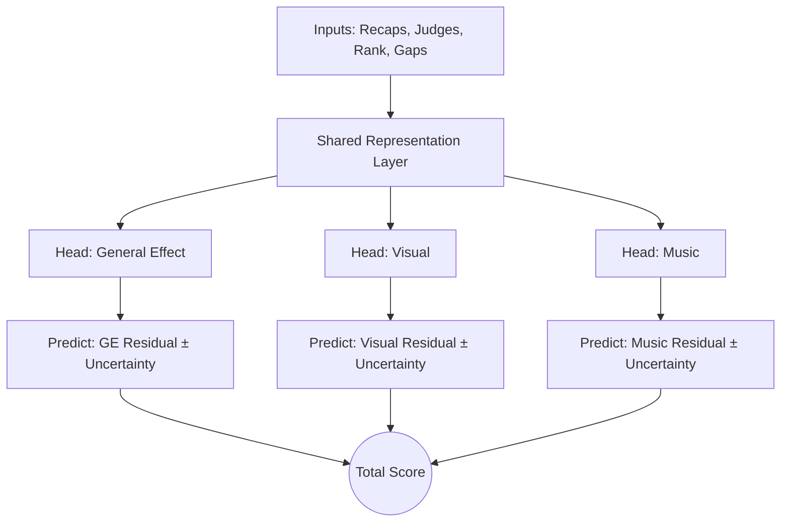

# v2 Plan: The Recap Prediction Model

**Objective**: Upgrade the model from predicting a single scalar (`Total Score`) to predicting the **entire breakdown** of the scorecard (Captions) using a "Rank-Driven Residual" approach.

---

## 1. Core Philosophy: "The Formula" + "The Deviation"
DCI scoring is highly structured. A corps' score is largely determined by its **Rank** and the **Date**.
*   **v1 Flaw**: It tried to learn the "Calendar Curve" from scratch.
*   **v2 Fix**: We explicitly model the curve.
    *   **Base Prediction**: Historical Average for {Rank, Date}.
    *   **Model Prediction**: The **Residual** (deviation) caused by performance quality, judge biases, and momentum.

---

## 2. Multi-Task Architecture (The "Recap")
We will switch from a single-output model to a **Multi-Head Network**.

### Architecture Diagram

### Targets
The model predicts 8 Caption Totals (GE1, GE2, Visual Proficiency, Visual Analysis, Color Guard, Brass, Music Analysis, Percussion).

### Input Features
We feed the model a rich history vector:
*   **Scores**: `lastScore_GE1`, `lastScore_Music`, ...
*   **Ranks**: `lastRank_GE1`, `lastRank_Visual`, ... (Critical for "State of the Race")
*   **Context**: `gapToLeader`, `daysSinceLastShow`.
*   **Judges**: `judgeEmbedding_GE1`, `judgeEmbedding_Perc`, ...
*   **Caption/Subcaption Context (NEW)**:
    *   **Historical Sub-Metrics**: `lastContent_Perc`, `lastAchievement_Perc`. This helps the model know *why* a score was low (e.g. "Hard show, poor execution").
    *   **Caption Identity**: One-Hot or Embedding for the caption type (fed to shared layers).

---

## 3. Robustness & Research Principles

### A. Rank-Driven Residuals
*   **Data Prep**: Compute `ReferenceCurve(Rank, DayOfSeason)` -> `AvgScore`.
*   **Target**: `Target = ActualScore - ReferenceScore`.
*   **Inference**: `PredictedScore = ReferenceScore + PredictedResidual`.

### B. Uncertainty Estimation (Aleatoric)
*   Each head outputs 3 values: `p10`, `p50`, `p90`.
*   **Early Season**: The model learns to output wide intervals (high uncertainty).
*   **Late Season**: The model learns to tighten the intervals.

### C. Judge Dropout ("Cold Start")
*   During training, randomly mask Judge IDs (set to `UNK`) with probability $p=0.1$.
*   This ensures the model doesn't crash on "TBA" judges and learns to rely on the corps' performance history as a fallback.

### D. Consistency Loss
*   Enforce `TotalScore ≈ Sum(CaptionScores)`.
*   Loss Function: `MSE(Total) + Sum(MSE(Captions)) + Lambda * |Total - Sum(Captions)|`.

---

## 4. Implementation Steps

### Phase 8a: Data Engineering (The Foundation)
1.  **Reference Curves**: Write script `scripts/computeReferenceCurves.ts` to generate the baseline lookup table.
2.  **Schema Update**: Add `y_recap_json` and `y_residuals_json` to `ml_training_rows`.
3.  **Featurization**: Update `mlQueries.ts` to fetch **Caption History** (e.g., `lastScore_Percussion`, `avgGap_Visual`).

### Phase 8b: Data Integrity & Verification (CRITICAL)
4.  **Completeness Audit**:
    *   Script: `scripts/auditData.ts`.
    *   Check: Are there ANY nulls in `lastScore` or `rank`? (If so, investigate why).
    *   Check: Do we have `ReferenceCurve` coverage for 100% of training rows?
5.  **Logic Checks**:
    *   Verify `ReferenceCurve`: Does Rank 1 always have a higher average than Rank 2? (If not, our curve logic is broken).
    *   Verify `Residuals`: Are residuals centered around 0? (If Mean is +5, bias exists).
6.  **Outlier Detection**:
    *   Flag any `Score > 100` or `Score < 0`.
    *   Flag any `Residual > 10` (implies massive data error).

### Phase 8c: Model Development
7.  **Functional API**: Rewrite `trainModel.ts` using `tf.model()` with multiple inputs/outputs.
8.  **Custom Loss**: Implement the Quantile Loss + Consistency Loss function.
9.  **Training**: Train on the 12-season dataset.

### Phase 8d: Inference & UI
10. **Predictor**: Update `predict.ts` to impute missing judges and sum the breakdown.
11. **UI**: Display the "Breakdown" and "Confidence Intervals".

---

## 5. Risks & Considerations

| Risk | Mitigation |
| :--- | :--- |
| **Variable Panels** | Use **Masking** in the loss function. If a show has no "Visual Analysis" judge, weight that head's loss to 0. |
| **Rank Volatility** | Early season ranks fluctuate. Use `prevSeasonRank` as a stabilizing anchor for the Reference Curve lookup. |
| **Data Sparse Regions** | Use "Global Average" for reference curves where data is thin (e.g., Open Class in early June). |

## 6. Future Work (v3 Research)
*   **Design Embeddings**: Scrape Repertoire strings and embed them (BERT) to Capture "Show Complexity".
*   **Venue Acoustics**: Add `venue_id` embeddings to model "Dome Effect" on music scores.

## 7. Anti-Overfitting & Generalization Strategy (CRITICAL)
DCI data is small (thousands of rows) but high-dimensional. Memorization is a major risk.

### A. Preventing Memorization
*   **Judge Dropout**: By randomly masking Judge IDs, we prevent the model from learning "Judge X = Score Y". It forces the model to look at the *corps* inputs.
*   **Residual Learning**: By predicting only the *deviation* from the "Rank Baseline", the model cannot simply memorize the calendar curve. It must extract "Performance Value".
*   **Information Bottleneck**: The Shared Trunk (128 units) acts as a compressor. It forces the model to distill 200+ inputs into 128 core concepts, discarding noise.

### B. Regularization
*   **L2 Weight Decay**: Apply `l2_regularization = 1e-4` to punish large weights.
*   **Dropout**: Use `Dropout(0.25)` in the dense layers to force redundant feature pathways.
*   **Cross-Validation**: We must strictly respect the `Validation Split (2023)` and NOT tune hyperparameters on the Test Set (2024).
